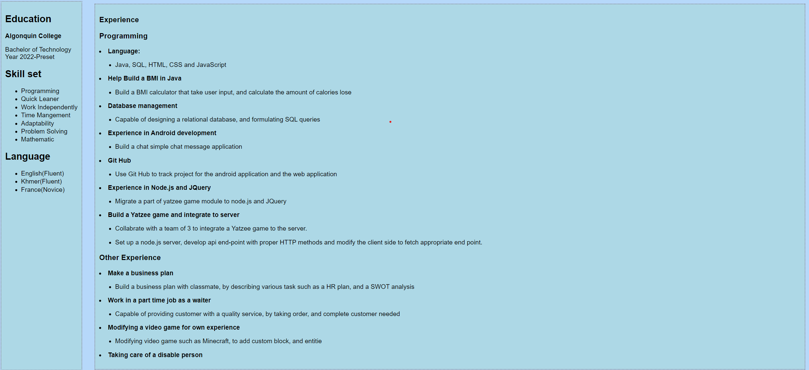

# Buntong Ngy's Portfolio Design System Documentation

  

This documentation provides a clear and simplified overview of my resume for the portfolio project. It includes colors, typography, components, and layouts, along with screenshots of mock-ups for clear communication of the design.

  

## **1. Color Palette**

I use a simple and clear color palette throughout the design.

  

- **Primary Color:** `#ADD8E6`

- **Text Color:** `#000000`

- **Second Text Color:** `#000000`

- **Border Color:** `##D3D3D3`

- **Background Color:** `#87CEEB`

- **Secondary Background Color:** `##ADD8E6`

- **Accent Color:** `#585ca8`

  

## **2. Typography**

- **Body Text:** `"Arial", Helvetica, sans-serif`

- **Headers:** `'Arials', Helvetica, sans-serif`

  

## **3. Components and Layout**

### Header

- **Design:** Centered Black text with a light blue background.

- **Mock-up Screenshot:**

  

### Navigation

- **Design:**Left-side text, with a purple background

- **Mock-up Screenshot:**

  

### Content

- **Design:** Left-side text, with a white background

- **Mock-up Screenshot:**

  

### Footer

- **Design:** White text, with blue background

- **Mock-up Screenshot:**

  

## **Conclusion**

This documentation serves as a resume to use in the portfolio project, aiming to facilitate development and maintain consistency in design throughout the project.